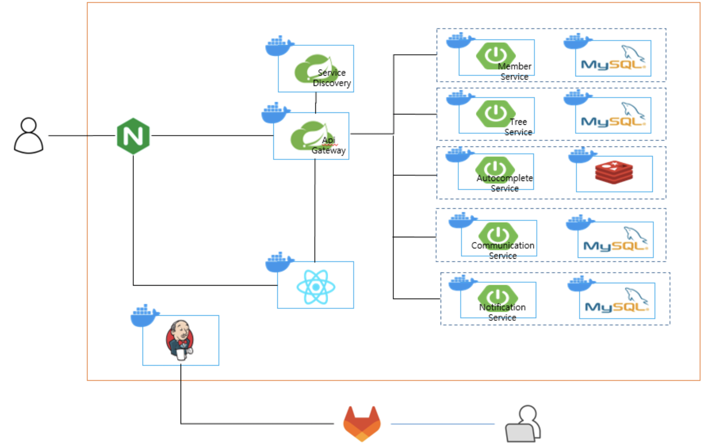
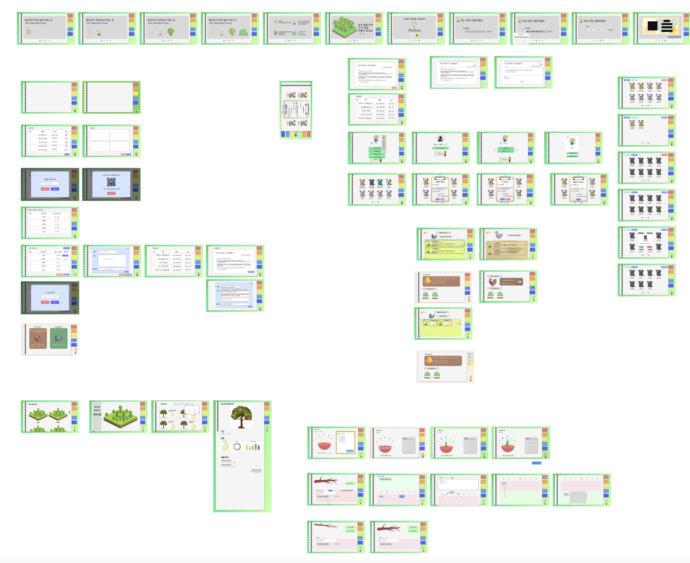
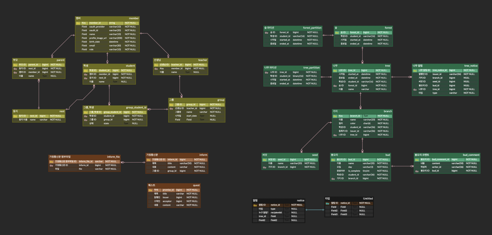

# [PlanTree](https://k9a302a.p.ssafy.io)

## SSAFY 9기 자율 프로젝트 - A302 (Sasung Data System)

### 우리 아이 자기주도 계획 관리 플랫폼, PlanTree

> [https://k9a302a.p.ssafy.io](https://k9a302a.p.ssafy.io)

# 👨‍👩‍👧‍👦 팀원 소개

- [배영석](https://github.com/BaeYoungSuk) : Backend / Leader
- [김연재](https://github.com/yeonjae0) : Frontend
- [신기정](https://github.com/467shin) : Frontend
- [오주영](https://github.com/jy0923) : Backend
- [정도현](https://github.com/cirel31) : Frontend
- [정예지](https://github.com/ityeji) : Frontend

# 📆 프로젝트 소개

- 프로젝트명  
  PlanTree

- 서비스 개요
  - 아이가 스스로 계획을 세우며 실천할 수 있도록 돕는다. Drag & Drop 형식으로 쉽게 계획을 등록하고 완료할 수 있다.
  - 선생님, 학부모가 계획의 큰 틀을 잡아주며, 아이는 그 틀 안에서 세부 계획을 작성할 수 있다. 또한, 선생님과 학부모는 아이와 계획에 대한 피드백을 주고 받을 수 있다.
  - 아이는 한 주 계획을 완료해감에 따라 그 주의 나무가 자라나는 모습을 확인할 수 있으며, 퀘스트 등의 게이미피케이션을 적용해 아이의 흥미를 유발한다.

# ✨기획 배경

* 아이들이 적절한 계획과 목표를 세우며 스스로 실천하는 능력을 키우기 위해 고안
* 선생님 및 학부모와의 효과적인 비대면 소통 경로 제공
* 게이미피케이션을 통해 흥미 유발과 성취감을 증진

# 🙌주요 기능

### 숲

* 아이의 일주일 계획 단위인 나무가 1년동안 모여 숲이 됩니다.
* 회원가입으로 새로운 학생 계정이 생성되면 해당 회원에게 자동으로 숲이 생성되며, 매 1학기가 시작될 때마다 회원들에게 새로운 숲이 생성됩니다.

### 나무

* 아이의 일주일 계획 단위입니다. 
* 매 일주일마다 자동으로 생성되어, 아이들의 주간 목표를 달성하고 성장하는 모습을 확인할 수 있습니다.
* 아이들의 성과에 따라 나무의 이미지가 변하며, 성취에 대한 시각적 보상을 제공합니다.
* 사용자의 활동 이력을 쉽게 조회할 수 있어, 성장과 학습에 대한 흔적을 확인할 수 있습니다.

### 가지

* 일주일 계획의 큰 틀입니다.

* 아이와 관계를 맺은 부모와 선생님은 내 아이의 나무에 가지를 등록해줄 수 있습니다. 아이 역시 자신의 나무에 가지를 등록할 수 있습니다.
* 가지는 자동으로 색깔이 부여되며, 일정을 시각적으로 구분할 수 있습니다.

### 봉오리

* 아이의 세부 계획입니다.
* 오직 아이만 봉오리를 등록하고 완료할 수 있습니다. 드래그 앤 드랍으로 편리하게 봉오리를 추가하거나 완료할 수 있습니다.

### 그룹, 둥지

* 그룹
  * 선생님과 아이은 그룹을 통해 관계를 맺을 수 있습니다.
  * 아이은 QR 코드를 통해 편리하게 그룹가입을 신청하고 선생님의 수락 하에 그룹에 가입됩니다.
  * 선생님은 그룹을 통해 반 아이들에게 일괄적으로 가지를 등록할 수 있으며, 가정통신문을 발행할 수 있습니다.
* 둥지
  * 학부모와 아이은 둥지를 통해 관계를 맺을 수 있습니다.
  * 아이은 QR 코드를 통해 둥지에 가입 가능합니다.
  * 학부모는 둥지 내 아이에게 퀘스트 형식으로 목표를 제공하고, 보상을 통해 아이의 흥미를 유발할 수 있습니다.

# 💁 설계

### 🧱 시스템 아키텍처 

### 와이어 프레임 및 디자인

### 🎨 ERD

### [📬 API 명세서](https://lightning-atmosphere-98f.notion.site/API-649b08473e904095a15896965ebef90a?pvs=4)

명세서는 링크로 참고해주세요.

# 향후 계획

- 아이의 현재 나무 및 가지, 봉오리 DB 파티셔닝 및 조회 성능 최적화

